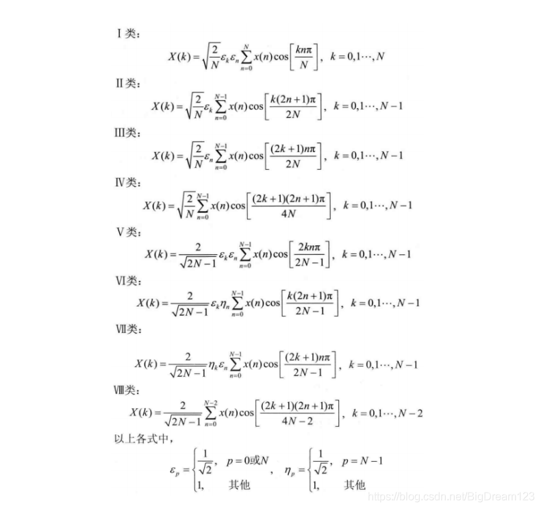

## DTC
- 傅里叶级数  
- 傅里叶变换
- 离散傅里叶变换 DFT 没有可用的代数方程计算求值

[图像处理的三种变换：DFT、DCT和DWT的联系和区别](https://zhuanlan.zhihu.com/p/355025756)  
是DFT的一种特殊形式。在DFT傅立叶级数展开式中，如果被展开的函数是实偶函数，那么其傅立叶级数就只包含余弦项，再将其离散化(DFT)可导出该余弦项的余弦变换就是离散余弦变换(DCT)。因此离散余弦变换相当于一个长度是其本身两倍的离散傅里叶变换。

- [\* 详解离散余弦变换（DCT）](https://zhuanlan.zhihu.com/p/85299446)
- [DCT变换 算法 LLM-DCT ANN-DCT](https://zhuanlan.zhihu.com/p/413252930)
- [图像处理中的DCT变换](https://zhuanlan.zhihu.com/p/676174673?utm_id=0)
- [DCT探究（离散余弦变换 Discrete Cosine Transform）](https://zhuanlan.zhihu.com/p/621406000)
- [\* DCT变换](https://blog.csdn.net/BigDream123/article/details/101426393)
- [一维 二维DCT变换 python实现](https://z2bns.github.io/2021/10/27/DCT%E7%A6%BB%E6%95%A3%E4%BD%99%E5%BC%A6%E5%8F%98%E6%8D%A2/)

先给出常见的DCT公式  
$$
\begin{align}
& F(u) = c(u)\sum_{x=0}^{N-1}f(x)cos[\frac{(x+0.5)\pi}{N}u] \\
& u=0 时 c(0) = \sqrt{1/n} \\
& 否则 c(u) = \surt{2/n}
\end{align}
$$

在图像视频领域中，最常用的是DCT-Ⅱ，平常说的DCT一般指的是DCT-Ⅱ。DCT-Ⅲ是 DCT-Ⅱ的反变换，一般说的反DCT指的就是DCT-Ⅲ。

对于DFT变换
$X[k] = \sum_{x=0}^{N-1}x[n](cos(\frac{2\pi kn}{N}) - jsin(\frac{2\pi kn}{N}))$  
对于两个sin cos项如果同时乘以一个偶函数，这两个sin cos项各自的奇偶性不变，（这里讨论的奇偶性是是关于$x=[0,N-1]$中心点的,这样虚数部分sin项就为0了  

于是有$X[k] = \sum_{n=0}^{N-1}x[n](cos\frac{2\pi kn}{N})$

接下来要对原始信号做一系列处理，1. 将信号关于y轴对称 2. 向正方向移动1/2个单位
$$
\begin{align}
x'[m] &= x[m](0<= m <= N-1) \\
x'[m] &= x[-m-1](-N<= m <= -1) \\
\end{align}
$$
得到
$$
\begin{align}
X[k] &= \sum_{m=-n}^{N-1} x'[m]e^{\frac{-j2\pi mk}{2N}} \\
带入sin项为0 \\
&= \sum_{m=-N+1/2}^{N-1/2}x'[m-1/2]cos(\frac{2\pi mk}{2N}) \quad (1.5)\\
&= 2*\sum_{m=1/2}^{N-1/2}x'[m-1/2]cos(\frac{\pi mk}{N}) \quad (1.5)\\
带入n=m-1/2(向左移动对齐)\\
&= 2*\sum_{n=0}^{N-1}x'[n]cos(\frac{(n+1/2)\pi k}{N})
\end{align}
$$
在之前给的DCT里有个c(u)，工程学上的意义，DFT中也常常会取$\frac{1}{N}$ 或 $\sqrt{\frac{1}{N}}$  
DCT变换变成矩阵运算的形式时又经常取 $\sqrt{\frac{1}{2N}}$（当k=0时除外）

[DCT（离散余弦变换）为什么不能做频谱分析？ - John Xu的回答 - 知乎](https://www.zhihu.com/question/23792822/answer/122153477)

DCT缺少相位信息，对于信号里的sin分量取的是2倍周期后的cos分量来表示  

对一个偶函数做DFT不会丢失sin分量吗?
信号对称后 自己的cos分量不变 sin分量会分出一部分到2倍周期的cos分量上。  所以DCT $X[k] = \sum_{n=0}^{N-1}x[n](cos\frac{2\pi kn}{N})$中并不能直接把sin项去掉，只是DCT后sin项的幅度信息有得到保留

jpeg做了dct有办法还原吗(看具体实现是怎么处理的把)

## FFT

[二维离散傅里叶（DFT）以及快速傅里叶（FTT）的实现](https://zhuanlan.zhihu.com/p/36377799)  
[快速傅里叶变换（FFT）超详解](https://zhuanlan.zhihu.com/p/347091298)  
[信号与系统笔记(八)：离散傅里叶变换(DFT)](https://zhuanlan.zhihu.com/p/584131911)  
[快速傅里叶变换（FFT）之一：Radix-2 DIT FFT](https://zhuanlan.zhihu.com/p/663306670)

DIT-FFT和DIF-FFT

## JPEG
- [JPEG编解码原理](https://zhuanlan.zhihu.com/p/62286932)  
- [影像算法解析——JPEG 压缩算法](https://zhuanlan.zhihu.com/p/40356456)
- [JPEG图像压缩详解和代码实现](https://zhuanlan.zhihu.com/p/601614313)
- [wiki - JPEG](https://zh.wikipedia.org/wiki/JPEG)
<!-- 规范 -->

