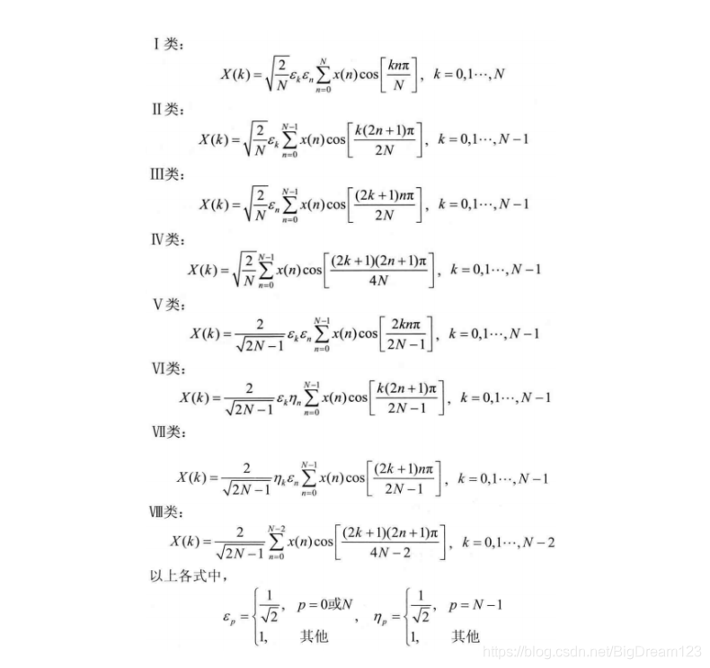

## 和差化积
[百度百科 和差化积](https://baike.baidu.com/item/%E7%A7%AF%E5%8C%96%E5%92%8C%E5%B7%AE/6973123)
[知乎 和差化积的几何直觉](https://zhuanlan.zhihu.c om/p/184757814)

**积化和差**  
  
  

  
  

异积 = s和+-s差  
同积 = c和+负s差

**和差化积**  

  
  

  
  

s和差 = 异积+-异积  
c和差 = c积-+s积

## 傅里叶级数
- [傅里叶级数和傅里叶变换是什么关系？](https://www.zhihu.com/question/21665935)
- [傅里叶系列（一）傅里叶级数的推导](https://zhuanlan.zhihu.com/p/41455378)

周期函数能够通过傅里叶级数画出频域图  
周期T=∞时频域图变为连续的曲线，引入复函数e，得到傅立叶变换

傅里叶公式
$$ 
\begin{align}
f(t) &= A_0 + \sum_{n=1}^{\infty }A_{n}sin(n\omega t+\psi _{n})\\
&=  A_0 + \sum_{n=1}^{\infty }A_{n}(sin(n\omega t)cos(\psi_n) + cos(n\omega t)sin(\psi_{n}))
\end{align} 
$$
令 $a_n=An\cdot sin\psi_n,b=A_n\cdot cos\psi_n$得到 **(6)**
$$
f(t) = A_0 + \sum_{n=1}^{\infty}[a_n cos(n \omega t) + b_n sin(n\omega t)]
$$

泰勒级数 麦克劳林 原理
$$
f(x) = A + Bx + Cx^2 + Dx^3 ... \\
f'(x) = B + 2Cx + 3Dx^2... \\
f''(x) = 2C + 6Dx + ... \\

逐次对函数求导给未知数降幂 \\
把x=0带入傅里叶级数的函数和原函数 就可以把每一级系数ABC求出来\\
原理 通过求导拆解出每一项的系数，通过x=0把后面项清空\\
A = f(0) \\
B = f'(0) \\
C = {f}''(0) /2 \\
D = {f}'''(0) /(1*2*3) \\
$$

 
在傅里叶级数中 通过 

### 计算$A_0$
把(6)式在 $n\omega t$为-Π到Π的区间内积分，
$$
\begin{align}
\int_{-\pi}^{\pi}f(t) &= \int_{-\pi}^{\pi}A_0 + \int_{-\pi}^{\pi}A_0\sum_{m=1}^{\infty}[a_ncos(n\omega t) + b_n sin(n\omega t)] \\
&=2\pi A_0
\end{align}
\\
\therefore A_0 = \frac{1}{2\pi} \int_{-\pi}^{\pi}f(t)
$$

### 计算$a_n b_n$

1. 和差化积公式 
2. -Π到Π区间正交函数积分为0来消除项  
  (k)

把(6)式两边同时乘以 cos(k&omega;t) 然后积分  
同乘 $cos(k\omega t)$
$$
\begin{align}
f(t)\cdot cos(k\omega t) =& A_0 \cdot cos(k\omega t) + \\ 
& \sum_{n=1}^{\infty}[a_n cos(n \omega t) \cdot cos(k\omega t) + b_n sin(n\omega t) \cdot cos(k\omega t)]
\end{align}
$$

积分 并且令k=n时只有蓝色项不为0
$$
\begin{align}
\int_{-\pi}^{\pi}f(t) \cdot cos(k\omega t) dt &= A_0{\color{Red} \int_{-\pi}^{\pi} cos(k\omega t) dt} + \\
&\sum_{m=1}^{\infty}[a_n{\color{Blue}\int_{-\pi}^{\pi}cos(n\omega t) \cdot cos(k\omega t) dt}  + b_n {\color{Red} \int_{-\pi}^{\pi} sin(n\omega t) \cdot cos(k\omega t) dt }] \\
&= a_n \int_{-\pi}^{\pi} cos^2(n\omega t)dt\\
&= \frac{a_n}{2}\int_{-\pi}^\pi(1+cos2n\omega t) dt \qquad\text{(半角公式)}\\
&=\frac{a_n}{2}(\int_{-\pi}^\pi 1dt + {\color{Red} \int_{-\pi}^\pi cos(2n\omega t) dt})\\
&=a_n\pi
\end{align}
\\
\\
\therefore a_n = \frac{1}{\pi}\int_{-\pi}^{\pi}cos(n\omega t)\cdot f(t)dt \quad (k=n)
$$

同理得
$$
\therefore b_n = \frac{1}{\pi}\int_{-\pi}^{\pi}sin(n\omega t)\cdot f(t)dt \quad (k=n)
$$

令 a_0 = 2A_0 假设T = 2Π  
最终
$$
\begin{align}
f(t) &= a_0/2 + \sum_{n=1}^\infty[a_n cos(n\omega t) + b_n sin(n\omega t)] \\
a_0 &= \frac{2}{T}\int_{-\pi}^{\pi}f(t)dt\\
a_n &= \frac{2}{T}\int_{t_0}^{t_0+T}f(t)cos(n\omega t)dt \\
b_n &= \frac{2}{T}\int_{t_0}^{t_0+T}f(t)sin(n\omega t)dt \\
\end{align}
$$

## 傅里叶变换推导详解
[傅里叶变换推导详解](https://zhuanlan.zhihu.com/p/77345128)  
波幅 相位与傅里叶级数$a_n \quad b_n$的关系
$$
\begin{align}
c_n &= \sqrt{{a_n}^2+{b_n}^2} \\
\varphi &= arctan(-\frac{b_n}{a_n})
\end{align}
$$

#### 复变函数到傅里叶级数
引入复数函数表达式：(和欧拉公式有关?)  
$e^{j\theta} = cos\theta + j sin\theta $  
又 $\theta = \omega t = \frac{2\pi}{T}t $  
得 $e^{j\omega t} = cos(\omega t) + jsin(\omega t)$  
设一组三角函数 频率是$cos\omega t$的整数n倍,则这些三角函数为  
$$
\begin{align}
cos(n\omega t) &= \frac{e^{jn\omega t} + e^{-jn\omega t}}{2} \\
sin(n\omega t) &= \frac{e^{jn\omega t} - e^{-jn\omega t}}{2j}
\end{align}
$$
带入傅里叶级数得
$$
\begin{align}
f(t) &= c_0 + \sum_{n=1}^{\infty}[a_n\frac{e^{jn\omega t} + e^{-jn\omega t}}{2} + b_n\frac{e^{jn\omega t} - e^{-jn\omega t }}{2j}] \\ 
f(t) &= c_0 + \sum_{n=1}^{\infty}[\frac{(a_n-jb_n)}{2}e^{jn\omega t}+\frac{(a_n + jb_n)}{2}e^{-jn\omega t}]
\end{align}
$$
$a_n\quad b_n$是三角函数的积分所以
$$
a_{-n} = a_n\\
b_{-n} = b_n
$$
带入可得
$$

f(t) = c_0 + \sum_{n=1}^{\infty}[\frac{(a_n-jb_n)}{2}e^{jn\omega t}+\frac{(a_{-n} + jb_{-n})}{2}e^{-jn\omega t}]\\
f(t) = c_0 + \sum_{n=1}^{\infty}\frac{(a_n-jb_n)}{2}e^{jn\omega t}+\sum_{n=-1}^{-\infty}\frac{(a_{n} - jb_{n})}{2}e^{jn\omega t}
$$
$c_0$即为n=0的情况， 所以
$$
f(t) = \sum_{n=-\infty}^\infty \frac{(a_n-jb_n)}{2}e^{jn\omega t}
$$
设 $A_n = \frac{(a_n-jb_n)}{2}$得  
$f(t) = \sum_{n=-\infty}^\infty A_n e^{jn\omega t}$

**现在要去除求和符号把$A_n$提出来，通过代数计算做变换**

两边同乘以$e^{-jk\omega t}$并积分 
$$
\int_0^Tf(t)e^{-jk\omega t}dt = \int_0^T\sum_{n=-\infty}^{\infty}A_ne^{j(n-l)\omega t}dt
$$
带入三角函数正交积分为零推论，此时右边只有n=k 时有值

$$
\int_0^Tf(t)e^{-jn\omega t}dt = A_nT \\
得 A_n = \frac{1}{T}\int_0^Tf(t)e^{-jn\omega t}dt \\
幅值 \left|A_n\right| = \frac{1}{2}\sqrt{{a_n}^2 + {b_n}^2 } = \frac{1}{2}c_n
$$

#### 周期性离散时间傅里叶变换

下面的$\Sigma$下标n k t描述可能不对

设离散时间的采样样本为 x[t],其周期为T,那么,其应该频率是 $\frac{2\pi}{T}$ 有公式描述：  
$x[t] = x[t+kT]$  

设经历时间$t = <T>$即一个周期内的采样点，则周期离散傅里叶级数可写成  
$x[t] = \sum_{n=<T>}A_ne^{jn\omega t} \quad(3.36)$  

两边同乘以$e^{-jk\omega t}$ (傅里叶公式中加入采样的函数描述，k来自采样 n来自傅里叶)  
$x[t]e^{-jk\omega t} = \sum_{n=<T>}A_ne^{jn\omega t}e^{-jk\omega t}$  

两边同时进行T项上的求和  
$\sum_{t=<T>}x[t]e^{-jk\omega t} = \sum_{t=<T>}\sum_{n=<T>}A_ne^{j(n-k)\omega t}$  

上式同样满足当n不等于k时,周期的累加和为0,因此,上式可变为  
$\sum_{t=<T>}x[t]e^{-jk\omega t} = T A_n$  

最终得 $A_n = \frac{1}{T}\sum_{t=<T>}x[t]e^{-jn\omega t} \quad(3.39)$

#### 非周期离散时间傅里叶变换
#### 非周期有限长度离散时间傅里叶变换

## DTC
- 傅里叶级数  
- 傅里叶变换
- 离散傅里叶变换 DFT 没有可用的代数方程计算求值

[图像处理的三种变换：DFT、DCT和DWT的联系和区别](https://zhuanlan.zhihu.com/p/355025756)  
是DFT的一种特殊形式。在DFT傅立叶级数展开式中，如果被展开的函数是实偶函数，那么其傅立叶级数就只包含余弦项，再将其离散化(DFT)可导出该余弦项的余弦变换就是离散余弦变换(DCT)。因此离散余弦变换相当于一个长度是其本身两倍的离散傅里叶变换。

- [DCT变换](https://zhuanlan.zhihu.com/p/413252930)
- [图像处理中的DCT变换](https://zhuanlan.zhihu.com/p/676174673?utm_id=0)
- [详解离散余弦变换（DCT）](https://zhuanlan.zhihu.com/p/85299446)
- [DCT探究（离散余弦变换 Discrete Cosine Transform）](https://zhuanlan.zhihu.com/p/621406000)
- [DCT变换](https://blog.csdn.net/BigDream123/article/details/101426393)
- [一维 二维DCT变换](https://z2bns.github.io/2021/10/27/DCT%E7%A6%BB%E6%95%A3%E4%BD%99%E5%BC%A6%E5%8F%98%E6%8D%A2/)

在图像视频领域中，最常用的是DCT-Ⅱ，平常说的DCT一般指的是DCT-Ⅱ。DCT-Ⅲ是 DCT-Ⅱ的反变换，一般说的反DCT指的就是DCT-Ⅲ。

### JPEG
- [JPEG编解码原理](https://zhuanlan.zhihu.com/p/62286932)  
- [影像算法解析——JPEG 压缩算法](https://zhuanlan.zhihu.com/p/40356456)
- [JPEG图像压缩详解和代码实现](https://zhuanlan.zhihu.com/p/601614313)
- [wiki - JPEG](https://zh.wikipedia.org/wiki/JPEG)
<!-- 规范 -->
