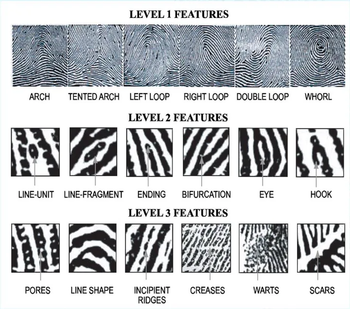

## 指纹识别

[生物特征识别：小面积指纹识别算法（一）](https://zhuanlan.zhihu.com/p/29136395)  
[生物特征识别：小面积指纹识别算法（二）](https://zhuanlan.zhihu.com/p/29523452)

标准ISO-19794，ANSI-374
对5mm x 5mm ~ 10mm x10mm的采集器

Minutiae 类型

- level 1
    - 拱 帐 左环 右环 双环 螺
- level 2
    - 线单元 线段 结束点 分叉 眼 勾
- level 3
    - 纹路孔 细纹 线型 折痕 疣 伤疤

通常使用的只有两种：端点（ending point)与叉点（bifurcation point)

进行特征点描述和特征点建模
贪心策略 构建结构 相似公式
方向场与频率场构建更为精细的指纹描述 对更小面积的指纹会更有效

小面积多次采集 小面积配准问题 多个模板的匹配关系
algo-256,512,2048

[利用OpenCV和Python实现一个指纹识别系统总目录](https://blog.csdn.net/MrCharles/article/details/114379513)

- [指纹的分割](https://firstai.blog.csdn.net/article/details/113511726)
- [估计局部脊线的方向](https://firstai.blog.csdn.net/article/details/113511726)
- [计算局部脊线的频率](https://firstai.blog.csdn.net/article/details/113520005)
- [指纹增强处理](https://firstai.blog.csdn.net/article/details/114370198)
- [细节点提取](https://firstai.blog.csdn.net/article/details/114373694)
- [细节点方向计算](https://firstai.blog.csdn.net/article/details/114377912)
- [基于Minutia](https://firstai.blog.csdn.net/article/details/114378722)
- [MCC匹配](https://firstai.blog.csdn.net/article/details/114378722)

//todo mcc

[利用OpenCV和Python实现一个指纹识别系统总目录](https://www.comp.hkbu.edu.hk/wsb2021/lecturer_details.php?lect_id=2)

## 面部识别
- [图像处理 人脸识别的三种经典算法与简单的CNN 【附Python实现】](https://www.cnblogs.com/FUJI-Mount/p/13021143.html)
    - PCA或LDA LBPH CNN
- [5种最著名的人脸识别算法和关键特征介绍](https://zhuanlan.zhihu.com/p/437153104)
    - CNN Eigenfaces Fisherfaces PCA和SVM HaarCascade 三维识别 皮肤纹理分析 热像仪 ANFIS LBPH FaceNet NEC FACE++

## 光流算法
// todo
[计算机视觉大型攻略 —— 光流（1）基本原理和经典算法](https://blog.csdn.net/plateros/article/details/102931138)

典算法Lucas-Kanade，Horn-schunk

- 颜色/亮度恒定假设(Color Constancy/Brightness Constancy)
- 小运动假设

[光流法（optical flow methods）](https://zhuanlan.zhihu.com/p/384651830)  
[光流算法：从传统算法到深度学习](https://zhuanlan.zhihu.com/p/660866515)  

## 自定义
diff x diff y 
 - 各自滤波 蒙版 (如何精确定位) 指定范围进行diff
 - 或者相乘滤波 匹配区域校验(包括了位置和纹理校验)   

